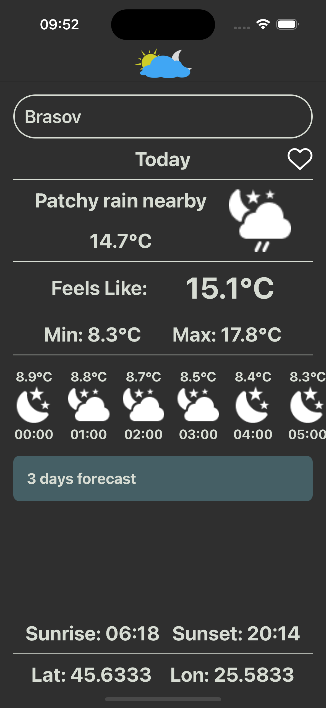
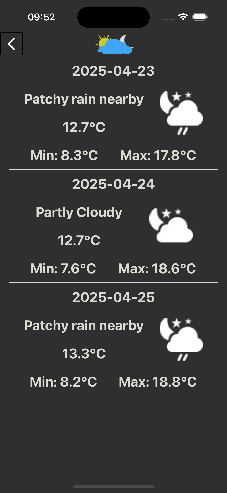
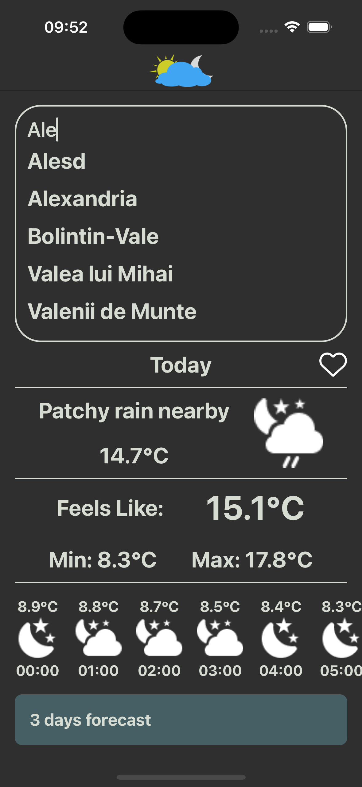

# 🌤️ WeatherApp (React Native)

A mobile weather app for tracking real-time conditions and **14-day forecasts** for cities worldwide.  
Includes search functionality, detailed forecasts, favorites management, and persistent local storage.

## 📘 Overview

This app is built for users who want **quick and easy access** to weather data with a clean and intuitive UI.

Users can:
- Search for any city and view **current weather details**
- See a **3-day forecast** with daily breakdowns
- Save **favorite cities** for quick access
- View **sunrise/sunset times** and **latitude/longitude**
- Navigate seamlessly between screens using a **stack navigator**

## ✨ Features

- 🔎 **Search** for any city worldwide
- 📅 **3-day forecast** with daily weather details
- ❤️ **Favorites management** for cities (stored locally)
- 🌅 **Sunrise & sunset times**, **latitude & longitude**
- 🌤️ **Dynamic weather icons** based on condition codes and time (day/night)
- 🔁 **Persistent storage** of favorites and last viewed city using **AsyncStorage**
- 🧭 Smooth **navigation** between Home, Forecast, and Air Quality screens

## 🈶 What You Learn

The app showcases **real-world integration** with an external API, **state management**, and **persistent local storage** using React Native.

Key concepts:
- **API calls** to fetch real-time data from **WeatherAPI**
- **Favorites management** with **AsyncStorage**
- **Conditional rendering** based on API responses (like dynamic icons)
- **Navigation** between multiple screens (Home, Forecast, Air Quality)
- **Search functionality** with filtered results

Each weather report includes:
- Temperature (current, feels like, min/max)
- Weather conditions (e.g., sunny, cloudy)
- Forecast data (daily breakdown for 14 days)
- Additional details like **sunrise/sunset** and **coordinates**

## 📸 Screenshots

<div align="center">
  
  
  
</div>


### 📦 Install Dependencies

```bash
npm install
```

## 🚀 Running the Project

Before you begin, make sure your environment is set up for React Native:
👉 React Native - Environment Setup


To get started, follow these steps:
```bash
yarn start
yarn android or yarn ios
```

## 🧰 Tech Stack

- **React Native** `0.76.x`
- **TypeScript** `5.x`
- **React Navigation** – stack navigation between screens
- **WeatherAPI** – xternal service for weather data
- **Axios / fetch** – API calls to WeatherAPI
- **Async Storage** – for persistent local data

## 📌 Future Improvements

- Add dark mode
- Implement air quality index details (full support)
- Add better error handling (e.g., for no network or API errors)
- Add location-based weather (GPS support)
- Add location-based weather (GPS support)


## 👤 Author

Made by **Andrei** — Junior React Native Developer passionate about clean UI, educational tools, and leveling up fast.


## ✉️ Contact

Feel free to reach out:

- GitHub: (https://github.com/BusuRN)
- LinkedIn: (https://www.linkedin.com/in/andrei-busuioc-b692b02aa/)
- Email: andreialexandrubusuioc@outlook.com
